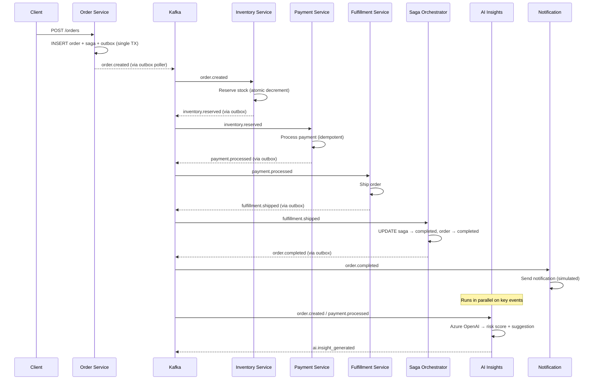
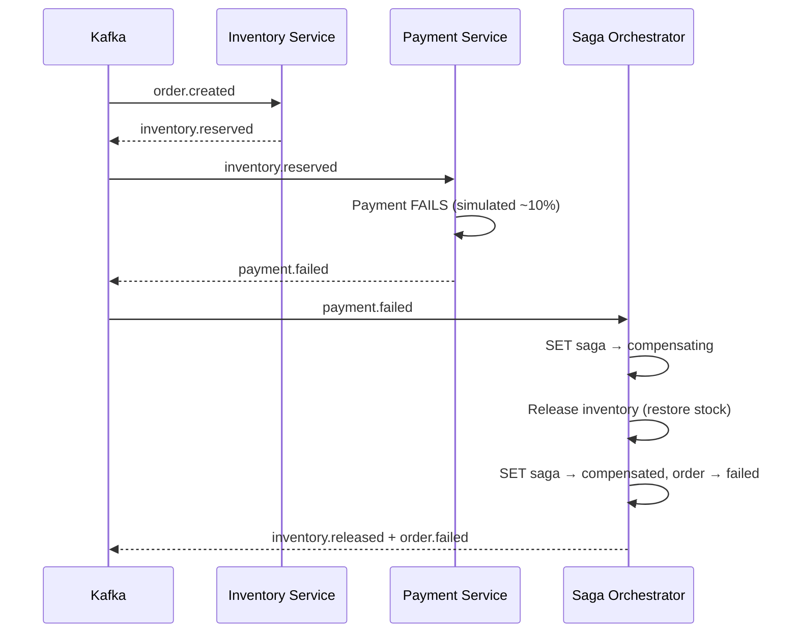
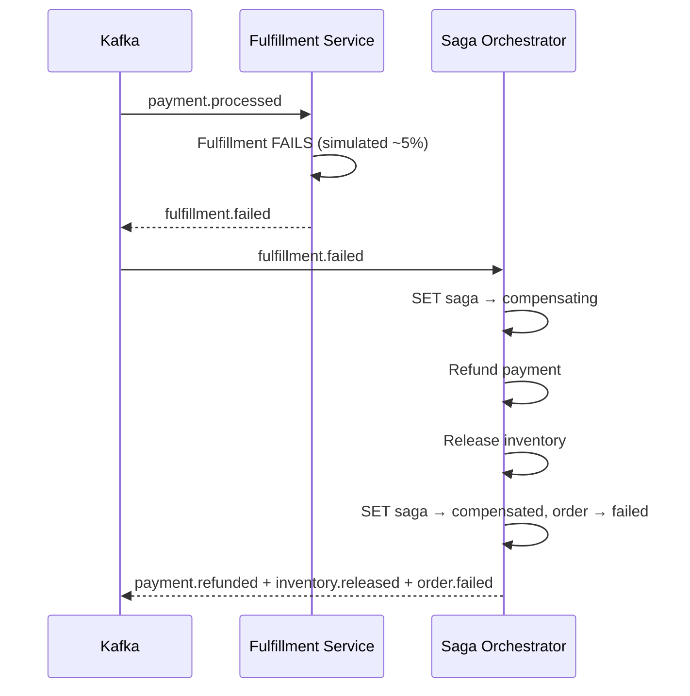

# SagaForge AI

**Reliable distributed business transactions with AI intelligence.**

SagaForge AI is a production-grade, event-driven **Saga Orchestrator** that coordinates complex, long-running business processes across independent microservices. It guarantees eventual consistency without distributed locks or 2PC, provides automatic compensation on failures, and adds **real-time AI insights** (risk scoring, optimization suggestions, anomaly detection) on live events.

Built for mid-sized e-commerce/marketplace platforms where fragile multi-step workflows lead to failed orders, manual reconciliation, and revenue loss.

---

## Architecture

```
                          ┌──────────────────────────────────┐
                          │        Dashboard (:8080)         │
                          │   HTMX + SSE Live Event Feed     │
                          └──────────┬───────────────────────┘
                                     │ SSE
                          ┌──────────▼───────────────────────┐
                          │          Kafka (Azure Event Hubs) │
                          │                                   │
┌─────────┐  HTTP POST    │  order-events                     │
│  Client  │─────────────▶│  inventory-events                 │
└─────────┘               │  payment-events                   │
        │                 │  fulfillment-events                │
        ▼                 │  saga-events                       │
┌───────────────┐         │  ai-insight-events                 │
│ Order Service │──outbox─▶│  dlq                              │
│   (:8081)     │         └──┬────┬────┬────┬────┬────────────┘
└───────────────┘            │    │    │    │    │
                             ▼    ▼    ▼    ▼    ▼
                    ┌────────┐ ┌──────┐ ┌────────┐ ┌──────────────┐
                    │Inventory│ │Payment│ │Fulfill-│ │  Saga        │
                    │Service  │ │Service│ │ment    │ │  Orchestrator│
                    └───┬─────┘ └──┬───┘ └──┬─────┘ └──────┬───────┘
                        │          │        │               │
                        └──────────┴────────┴───────────────┘
                                        │
                              ┌─────────▼──────────┐
                              │  AI Insights Service│
                              │  (Azure OpenAI)     │
                              └─────────┬──────────┘
                                        │
                              ┌─────────▼──────────┐
                              │ Notification Service│
                              └────────────────────┘

         All services ──── Transactional Outbox ────▶ Kafka
                      (Postgres single-TX guarantee)
```

### Saga Flow — Happy Path



### Compensation Flow — Payment Failed



### Compensation Flow — Fulfillment Failed



---

## Key Design Decisions & Trade-offs

| Decision | Why | Trade-off |
|---|---|---|
| **Transactional Outbox** over CDC (Debezium) | Simpler to operate, no extra infra, same exactly-once guarantee at the application level | Polling introduces small latency (~500ms); CDC would be near-instant |
| **Choreography + Orchestrator hybrid** | Services are decoupled (choreography) but the orchestrator handles complex compensation logic | Orchestrator is a coordination point; pure choreography would need each service to know compensation logic |
| **Idempotency keys everywhere** | At-least-once Kafka delivery means handlers MUST be idempotent | Extra DB column + ON CONFLICT checks on every write |
| **SELECT FOR UPDATE SKIP LOCKED** in outbox poller | Safe for multiple poller instances (horizontal scaling) without duplicate publishes | Slightly more complex SQL; simple SELECT would cause duplicates under concurrency |
| **AI as async enrichment, not in the critical path** | LLM latency (~1-3s) would block saga progression if synchronous | Insights arrive after the fact, not before the decision |
| **Single shared Postgres** (Supabase) for demo | Simpler to operate for a portfolio demo | In production, each service would own its database (database-per-service pattern) |

---

## Tech Stack

| Component | Technology |
|---|---|
| Services | Go 1.23+ |
| Database | Supabase (Postgres) |
| Messaging | Azure Event Hubs (Kafka protocol) |
| AI | Azure OpenAI (GPT-4o) |
| Dashboard | HTMX + Server-Sent Events |
| HTTP Framework | Echo v4 |
| Logging | Zap (structured JSON) |

---

## Project Structure

```
sagaforge-ai/
├── cmd/
│   ├── order-service/          # HTTP API — creates orders + saga + outbox
│   ├── inventory-service/      # Kafka consumer — reserves/releases stock
│   ├── payment-service/        # Kafka consumer — processes/refunds payments
│   ├── fulfillment-service/    # Kafka consumer — ships orders
│   ├── saga-orchestrator/      # Kafka fan-out — state machine + compensation
│   ├── ai-insights-service/    # Kafka consumer — Azure OpenAI enrichment
│   ├── notification-service/   # Kafka consumer — email/webhook simulation
│   └── dashboard/              # HTMX UI + SSE live feed
├── internal/
│   ├── kafka/                  # Shared producer/consumer (SASL/TLS)
│   ├── outbox/                 # Transactional outbox poller
│   ├── db/                     # Postgres connection pool
│   └── models/                 # Canonical event types + saga status
├── migrations/
│   └── 001_init.sql            # Full schema + seed data
├── scripts/
│   ├── migrate.go              # Run migrations via Go
│   └── loadtest.go             # Concurrent order load tester
├── Makefile                    # Build, run, migrate targets
├── Procfile                    # Run all services (overmind/goreman)
├── docker-compose.yml          # Full local stack
└── .env.example                # All required env vars
```

---

## Quick Start

### Prerequisites

- Go 1.23+
- [Supabase](https://supabase.com) project (free tier)
- [Azure Event Hubs](https://azure.microsoft.com/en-us/products/event-hubs) namespace with Kafka protocol
- [Azure OpenAI](https://azure.microsoft.com/en-us/products/ai-services/openai-service) deployment (GPT-4o)
- [overmind](https://github.com/DarthSim/overmind) or [goreman](https://github.com/mattn/goreman) (to run all services)

### Setup

```bash
# 1. Clone
git clone https://github.com/kirtipurohit/sagaforge-ai.git
cd sagaforge-ai

# 2. Configure
cp .env.example .env
# Fill in: DATABASE_URL, KAFKA_*, AZURE_OPENAI_*

# 3. Run migrations
make migrate
# Or: go run scripts/migrate.go

# 4. Create Event Hubs topics
# In Azure Portal, create these 7 Event Hubs in your namespace:
# order-events, inventory-events, payment-events, fulfillment-events,
# saga-events, ai-insight-events, dlq

# 5. Start all services
brew install overmind  # one-time
make run-all

# 6. Open dashboard
open http://localhost:8080
# Click "Simulate Order" and watch the saga flow in real-time!
```

### Run Individual Services

```bash
make run-order         # Order Service on :8081
make run-inventory     # Inventory consumer
make run-payment       # Payment consumer
make run-fulfillment   # Fulfillment consumer
make run-orchestrator  # Saga Orchestrator
make run-ai            # AI Insights (Azure OpenAI)
make run-notification  # Notification consumer
make run-dashboard     # Dashboard on :8080
```

### Load Test

```bash
go run scripts/loadtest.go -orders 1000 -concurrency 50
```

---

## Simulated Failure Rates

For demo purposes, services simulate realistic failure scenarios:

| Service | Failure Rate | Triggers |
|---|---|---|
| Payment | ~10% | Compensation: release inventory |
| Fulfillment | ~5% | Compensation: refund payment + release inventory |

These rates ensure the dashboard shows a healthy mix of completed, failed, and compensated sagas during demos.

---

## Business Impact (Demo Metrics)

- **Eventual consistency** across 4+ services without 2PC or distributed locks
- **Automatic compensation** — zero manual reconciliation on failures
- **< 1% data loss** — transactional outbox guarantees no events are lost
- **AI-powered risk scoring** — real-time fraud/anomaly signals on every order
- **Horizontal scaling** — SKIP LOCKED outbox + Kafka consumer groups

---

## API

### Create Order

```bash
curl -X POST http://localhost:8081/orders \
  -H "Content-Type: application/json" \
  -d '{
    "customer_id": "cust-001",
    "items": [
      {"sku": "SKU-WIDGET-A", "quantity": 2, "price": 29.99},
      {"sku": "SKU-GADGET-X", "quantity": 1, "price": 49.99}
    ]
  }'
```

### Get Order

```bash
curl http://localhost:8081/orders/{order_id}
```

### Dashboard API

```
GET /api/sagas              # List recent sagas
GET /api/sagas/:id          # Saga detail
GET /api/events/:order_id   # Event timeline for an order
GET /api/insights/:order_id # AI insights for an order
GET /api/stats              # Aggregate stats
GET /api/stream             # SSE live event feed
POST /api/simulate          # Create a test order
```

---

## License

MIT

---

Built by [Kirti Purohit](https://github.com/kirtipurohit) — demonstrating distributed systems, event-driven architecture, and AI enrichment patterns.
